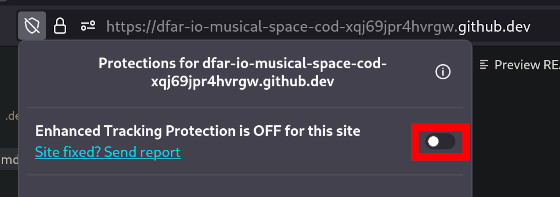

# gcp-sandbox
A sandbox for me to experiment working with GCP, including infrastructure with Terraform

## Locations:

* API: http://gcp.dfar.io
* UI: TBD

## Getting Started

Open the application in Github Codespaces. Some things to do:

In Firefox, turn off Enhanced Tracking Protection to allow web views:



### Setting up Terraform

Set up GCP CLI:

```
echo "deb [signed-by=/usr/share/keyrings/cloud.google.gpg] https://packages.cloud.google.com/apt cloud-sdk main" | sudo tee -a /etc/apt/sources.list.d/google-cloud-sdk.list
curl https://packages.cloud.google.com/apt/doc/apt-key.gpg | sudo apt-key --keyring /usr/share/keyrings/cloud.google.gpg add -
sudo apt-get update && sudo apt-get install -y google-cloud-cli
```

Log in to GCP:

`gcloud auth application-default login`

Run:

`terraform init`

Run:

`terraform apply`

### Running the API

To start the API, use the debugging mode (F5) in VSCode.

### Running the UI

To start the UI, go to the `ui` folder and run `ng serve`

_(this isn't working yet, I think it has to do with port forwarding)_

## Reference

Auth to GCP in Github Actions - https://github.com/google-github-actions/auth#authenticating-via-service-account-key-json